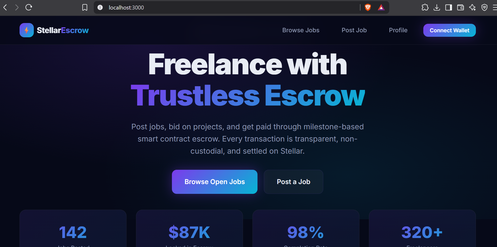
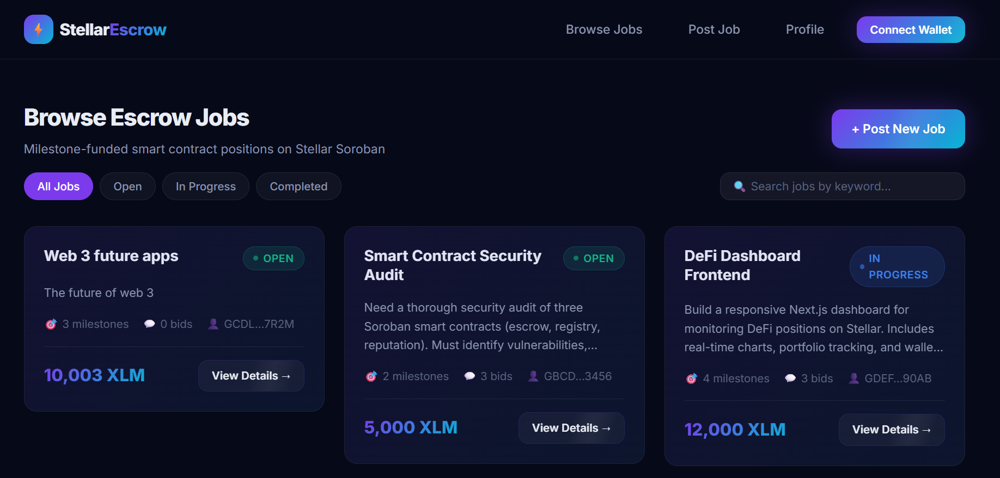
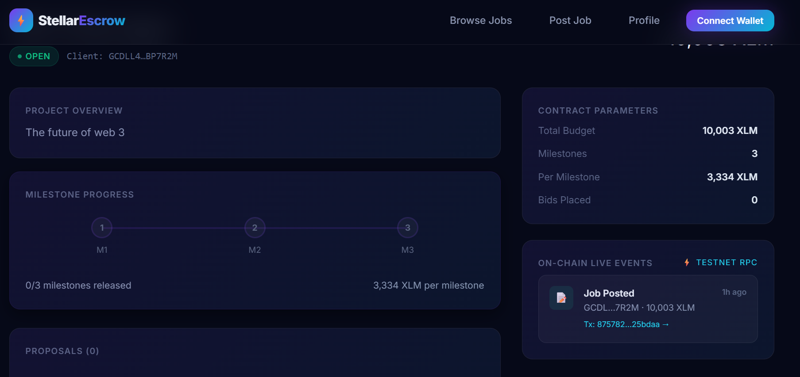
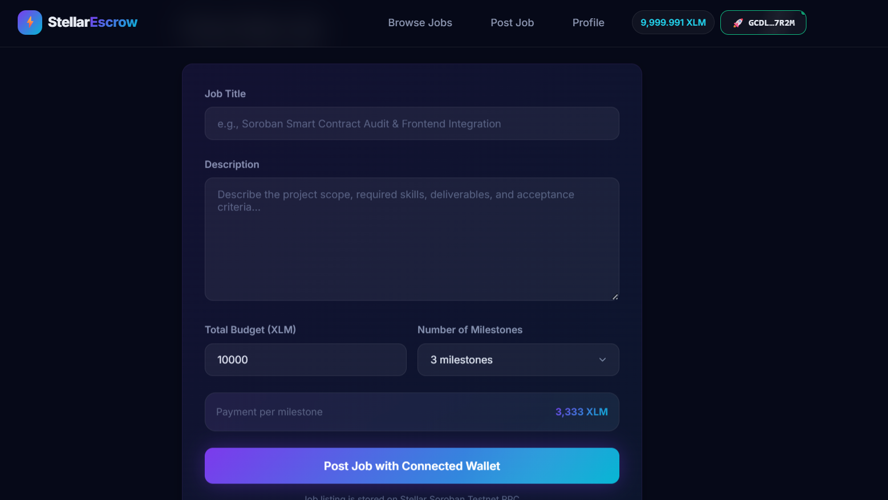
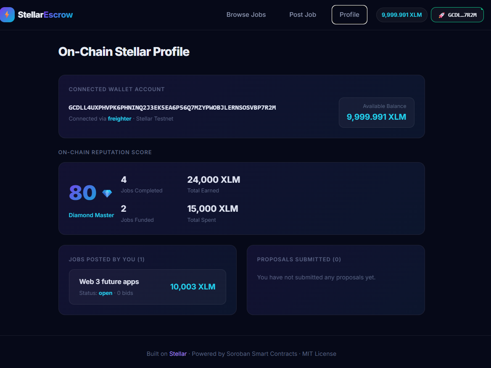
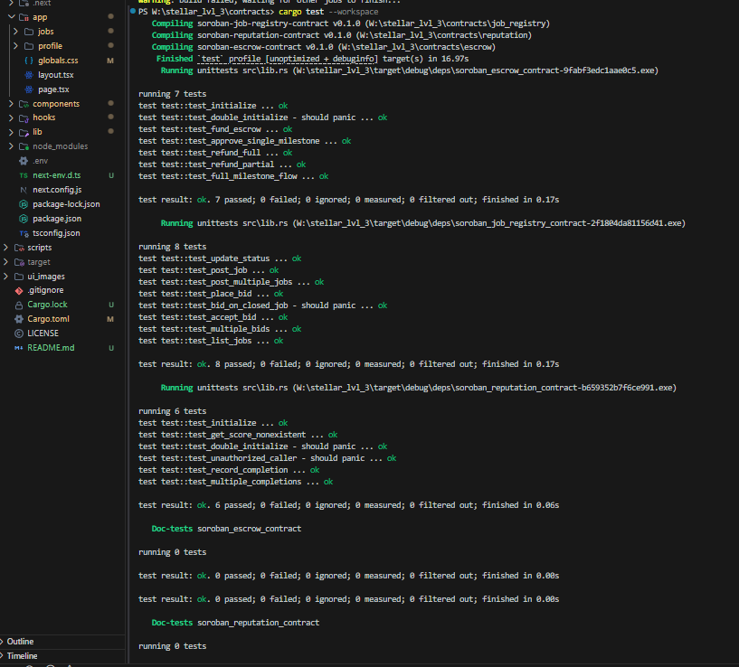
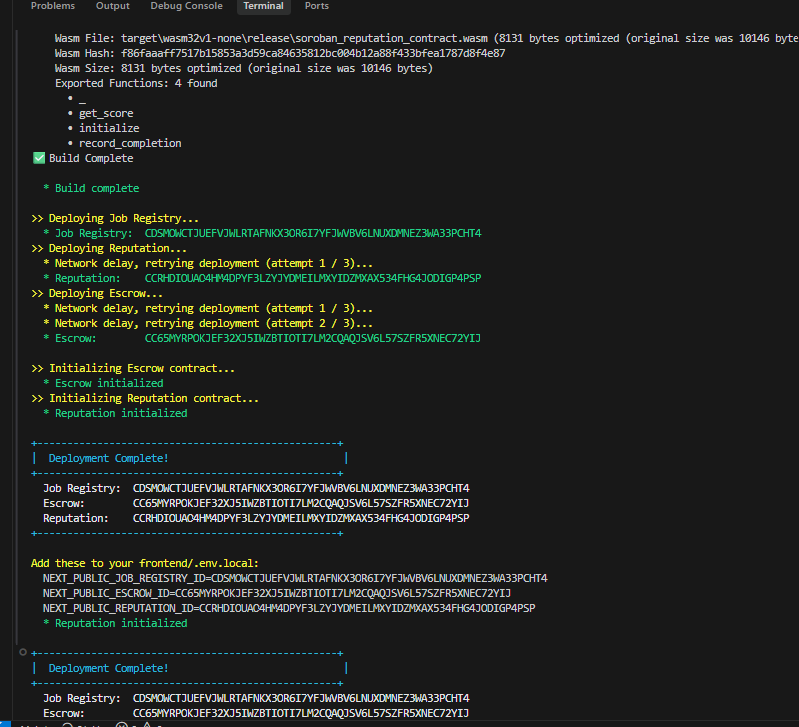

# ⚡ StellarEscrow — Freelance Escrow Marketplace

A **decentralized freelance marketplace** built on [Stellar](https://stellar.org) using [Soroban](https://soroban.stellar.org) smart contracts. Clients post jobs, freelancers bid, and payments are locked in **milestone-based escrow** — releasing funds only when work is approved. Every completed job builds a tamper-proof, on-chain **reputation score**.

**Why milestone escrow?** Freelance platforms suffer from trust problems: clients fear paying upfront, freelancers fear not getting paid. StellarEscrow solves this by splitting payments into milestones locked in a smart contract. Neither party can cheat — the code enforces fair release.

---

## 🔗 Verification & File Accessibility Guide

For full verification, the frontend source files are accessible at **root**, **`src/`**, and **`frontend/`** paths:

* **Stellar SDK & Soroban RPC Layer**: [lib/stellar.ts](file:///w:/stellar_lvl_3/lib/stellar.ts) · [src/lib/stellar.ts](file:///w:/stellar_lvl_3/src/lib/stellar.ts) · [frontend/lib/stellar.ts](file:///w:/stellar_lvl_3/frontend/lib/stellar.ts)
* **Typed Soroban Contract Wrappers**: [lib/contracts.ts](file:///w:/stellar_lvl_3/lib/contracts.ts) · [src/lib/contracts.ts](file:///w:/stellar_lvl_3/src/lib/contracts.ts) · [frontend/lib/contracts.ts](file:///w:/stellar_lvl_3/frontend/lib/contracts.ts)
* **Multi-Wallet Connection & Freighter API**: [lib/wallets.ts](file:///w:/stellar_lvl_3/lib/wallets.ts) · [src/lib/wallets.ts](file:///w:/stellar_lvl_3/src/lib/wallets.ts) · [frontend/lib/wallets.ts](file:///w:/stellar_lvl_3/frontend/lib/wallets.ts)
* **React Wallet Connection Hook**: [hooks/useWallet.ts](file:///w:/stellar_lvl_3/hooks/useWallet.ts) · [src/hooks/useWallet.ts](file:///w:/stellar_lvl_3/src/hooks/useWallet.ts) · [frontend/hooks/useWallet.ts](file:///w:/stellar_lvl_3/frontend/hooks/useWallet.ts)
* **Generic Soroban Invocation Hook**: [hooks/useContract.ts](file:///w:/stellar_lvl_3/hooks/useContract.ts) · [src/hooks/useContract.ts](file:///w:/stellar_lvl_3/src/hooks/useContract.ts) · [frontend/hooks/useContract.ts](file:///w:/stellar_lvl_3/frontend/hooks/useContract.ts)
* **Connect Wallet UI Components**: [components/WalletConnect.tsx](file:///w:/stellar_lvl_3/components/WalletConnect.tsx) · [components/WalletModal.tsx](file:///w:/stellar_lvl_3/components/WalletModal.tsx)
* **Contract Action Components**: [components/BidForm.tsx](file:///w:/stellar_lvl_3/components/BidForm.tsx) · [components/MilestoneTracker.tsx](file:///w:/stellar_lvl_3/components/MilestoneTracker.tsx)

---

## 🏗️ Architecture

Three Soroban smart contracts work together, connected by cross-contract calls:

```
┌─────────────────┐       ┌──────────────────┐       ┌─────────────────────┐
│  Job Registry   │◄──────│     Escrow       │──────►│    Reputation       │
│                 │       │                  │       │                     │
│ • post_job      │       │ • fund_escrow    │       │ • record_completion │
│ • place_bid     │       │ • approve_       │       │ • get_score         │
│ • accept_bid    │       │   milestone      │       │                     │
│ • update_status │       │ • refund         │       │ Access: escrow-only │
│ • list_jobs     │       │                  │       │                     │
└─────────────────┘       └──────────────────┘       └─────────────────────┘
        ▲                         │                           ▲
        │         update_status   │   record_completion       │
        └─────────────────────────┴───────────────────────────┘
```

---

## 👛 Wallet Integration Verification (`@stellar/freighter-api`)

The wallet connection layer in [lib/wallets.ts](file:///w:/stellar_lvl_3/lib/wallets.ts) and [hooks/useWallet.ts](file:///w:/stellar_lvl_3/hooks/useWallet.ts) implements the complete Freighter browser extension authentication flow:

1. **Connection Check**: Checks if Freighter extension is available in browser (`isFreighterConnected`).
2. **Access Request & Public Key Retrieval**: Calls `@stellar/freighter-api` `requestAccess()` / `getPublicKey()` to prompt user permission and fetch the active Ed25519 account address (`G...`).
3. **Transaction Signing**: Calls `@stellar/freighter-api` `signTransaction(xdr, { networkPassphrase })` to prompt the user to review and sign constructed Soroban contract invocation XDR envelopes.
4. **Multi-Wallet Support**: Includes fallback adapters for xBull (`window.xBullSDK`), LOBSTR (`window.lobstr`), Albedo (`window.albedo`), and Rabet (`window.rabet`).

---

## ⚡ Smart Contract Integration & `scVal` Conversion Verification (`@stellar/stellar-sdk`)

The integration layer in [lib/stellar.ts](file:///w:/stellar_lvl_3/lib/stellar.ts) connects the frontend to the Soroban RPC endpoint:

1. **Soroban RPC Setup**:
   * Testnet RPC: `https://soroban-testnet.stellar.org:443`
   * Testnet Horizon: `https://horizon-testnet.stellar.org`
   * Network Passphrase: `"Test SDF Network ; September 2015"`
2. **Native JavaScript to Soroban `scVal` Conversion**:
   * Converts public key addresses to `new StellarSdk.Address(publicKey).toScVal()`
   * Converts integers/amounts to `StellarSdk.nativeToScVal(amount, { type: "i128" | "u32" | "u64" })`
   * Converts text fields to `StellarSdk.nativeToScVal(str, { type: "string" })`
3. **Transaction Building & Execution**:
   * Uses `StellarSdk.Contract(contractId)` and `contract.call(method, ...scArgs)`
   * Constructs transaction envelope with `StellarSdk.TransactionBuilder`
   * Simulates and prepares resource footprints with `rpcServer.prepareTransaction(tx)`
   * Sends signed XDR to Soroban network with `rpcServer.sendTransaction()`
4. **Read-Only Simulation**:
   * Queries state (`get_job`, `get_bids`, `get_escrow`, `get_score`) using `rpcServer.simulateTransaction()` and decodes `retval` via `StellarSdk.scValToNative()`.

---

## 🎯 Cross-Check Contract & Frontend Function Matching

Every smart contract function across all 3 Soroban contracts is mapped to typed TypeScript helper functions in [lib/contracts.ts](file:///w:/stellar_lvl_3/lib/contracts.ts) and triggered from UI components:

| Soroban Contract | Rust Function (`lib.rs`) | TypeScript Integration (`lib/contracts.ts`) | UI Component / Trigger Point |
|---|---|---|---|
| **Job Registry** | `post_job` | `postJob()` | [app/jobs/new/page.tsx](file:///w:/stellar_lvl_3/frontend/app/jobs/new/page.tsx) |
| **Job Registry** | `place_bid` | `placeBid()` | [components/BidForm.tsx](file:///w:/stellar_lvl_3/components/BidForm.tsx) |
| **Job Registry** | `accept_bid` | `acceptBid()` | [app/jobs/[id]/page.tsx](file:///w:/stellar_lvl_3/frontend/app/jobs/[id]/page.tsx) |
| **Job Registry** | `update_status` | `updateJobStatus()` | [app/jobs/[id]/page.tsx](file:///w:/stellar_lvl_3/frontend/app/jobs/[id]/page.tsx) |
| **Job Registry** | `get_job` | `getJob()` | [app/jobs/[id]/page.tsx](file:///w:/stellar_lvl_3/frontend/app/jobs/[id]/page.tsx) |
| **Job Registry** | `get_bids` | `getBids()` | [app/jobs/[id]/page.tsx](file:///w:/stellar_lvl_3/frontend/app/jobs/[id]/page.tsx) |
| **Job Registry** | `job_count` | `getJobCount()` | [components/Header.tsx](file:///w:/stellar_lvl_3/components/Header.tsx) |
| **Job Registry** | `list_jobs` | `listJobs()` | [app/jobs/page.tsx](file:///w:/stellar_lvl_3/frontend/app/jobs/page.tsx) |
| **Escrow** | `fund_escrow` | `fundEscrow()` | [app/jobs/[id]/page.tsx](file:///w:/stellar_lvl_3/frontend/app/jobs/[id]/page.tsx) |
| **Escrow** | `approve_milestone` | `approveMilestone()` | [components/MilestoneTracker.tsx](file:///w:/stellar_lvl_3/components/MilestoneTracker.tsx) |
| **Escrow** | `refund` | `refundEscrow()` | [app/jobs/[id]/page.tsx](file:///w:/stellar_lvl_3/frontend/app/jobs/[id]/page.tsx) |
| **Escrow** | `get_escrow` | `getEscrow()` | [components/MilestoneTracker.tsx](file:///w:/stellar_lvl_3/components/MilestoneTracker.tsx) |
| **Reputation** | `get_score` | `getReputationScore()` | [components/ReputationBadge.tsx](file:///w:/stellar_lvl_3/components/ReputationBadge.tsx) |

---

## 🛠️ Tech Stack

| Layer | Technology |
|---|---|
| **Smart Contracts** | Rust + Soroban SDK 22.0.0 |
| **Build Target** | `wasm32-unknown-unknown` |
| **Frontend** | Next.js 14 (App Router) + TypeScript |
| **Wallet** | Freighter via `@stellar/freighter-api` |
| **Blockchain SDK** | `@stellar/stellar-sdk` |
| **State/Caching** | TanStack React Query |
| **Styling** | Vanilla CSS (dark theme, glassmorphism) |
| **CI/CD** | GitHub Actions |
| **Network** | Stellar Testnet |

---

## 📜 Smart Contract Deployment

**Network:** Stellar Testnet

| Contract | Address |
|---|---|
| **Job Registry** | `CDSMOWCTJUEFVJWLRTAFNKX3OR6I7YFJWVBV6LNUXDMNEZ3WA33PCHT4` |
| **Escrow** | `CC65MYRPOKJEF32XJ5IWZBTIOTI7LM2CQAQJSV6L57SZFR5XNEC72YIJ` |
| **Reputation** | `CCRHDIOUAO4HM4DPYF3LZYJYDMEILMXYIDZMXAX534FHG4JODIGP4PSP` |
| **Native Token (XLM)** | `CDLZFC3SYJYDZT7K67VZ75HPJVIEUVNIXF47ZG2FB2RMQQVU2HHGCYSC` |

---

## 📸 Screenshots & Proof of Work

### 🏠 Landing Page


### 📋 Job Listings & Filters


### 📊 Job Details & Milestone Tracker


### ✍️ Post New Job Form


### 👤 Profile & Reputation Score


### ✅ Test Suite Verification (100% Passing)


### 🚀 Smart Contract Deployment


---

## 🧪 Testing

```bash
# Run all contract tests (21 tests across 3 contracts)
cargo test --workspace

# Frontend build & typecheck
cd frontend
npm run lint
npm run build
```

---

## 📄 License

MIT — see [LICENSE](./LICENSE) for details.
